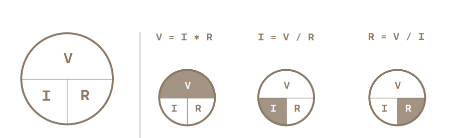
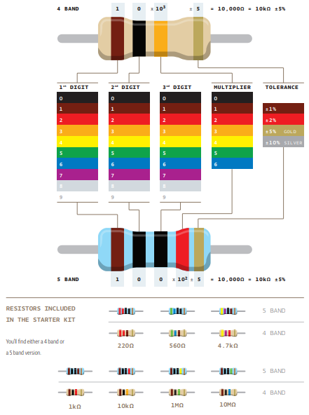

# Arduino Starter Kit R4


- [Structure](#structure)
- [Knowledge Base](#knowledge-base)

---

## Decscription

The repository contains projects created using the Arduino Starter Kit R4 based on official Arduino project book.
- list of required components
- connection diagram
- source code
---

### Project names
1. [Basics](./project_01/README.md/)
2. [Spaceship Interface](./project_02/README.md)
3. [Chill-o-Meter](./project_03/README.md)
4. [Color Mixing Lamp](#)
5. [Mood Cue](#)
6. [Light Theremin](#)
7. [Keyboard Instrument](#)
8. [Digital Hourglass](#)
9. [Motorized Pinwheel](#)
10. [Crystal Ball](#)
11. [Knock Lock](#)
12. [Touchy-feely lamp](#)
13. [Hacking Buttons](#)

---

## Structure

```text
arduino-starter-kit-r4/
│
├── README.md
├── project_01/
│   ├── schema/
│   └── README.md
├── project_02/
│   ├── code/
│   ├── schema/
│   └── README.md
├── project_03/
│   ├── code/
│   ├── schema/
│   └── README.md
├── ...
├── project_13/
│   ├── code/
│   ├── schema/
│   └── README.md
└── resource/
```

---
## Knowledge Base
### OHM’S Law
<p></p>
VOLTAGE (V) = CURRENT (I) * RESISTANCE (R)

### Resistors
<p></p>
